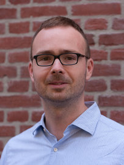
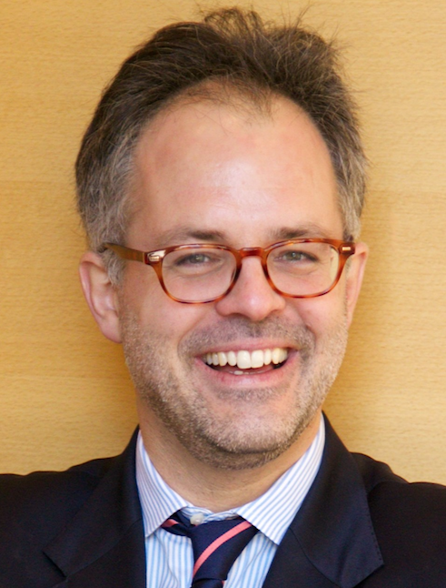
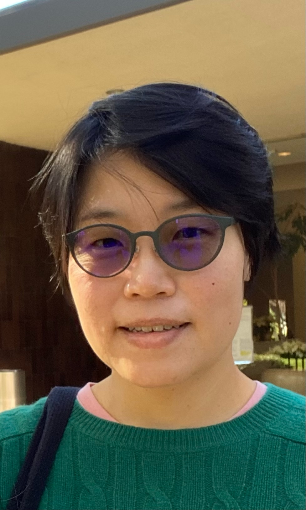

## Summer School in Optimal Transport

The common theme of this summer school is the mathematics of Monge-Kantorovich
optimal transport (OT). The stunning mathematical development of OT has recently
permeated into several fields of applications. Our speakers, chosen from the
fields of analysis, biology, data science, economics, and probability, are
leaders in their respective fields whose work intimately involves OT. Our goal
is to expose talented students and junior researchers to the exciting and
manifold research opportunities arising from OT and its applications, through
attending lectures and interacting with the speakers as well as their peer
participants. We strongly encourage participation by a diverse audience and
welcome attendees from traditionally underrepresented socio-economic and
cultural groups.

As the school is planned at the beginning of the summer season in Seattle, the
participants can also enjoy the natural beauty of the Pacific Northwest and feel
the energy of one of leading tech metropolises in the United States and around
the world.

## Main Speakers

  

    
Recent advances in dynamical optimal transport

    Jan Mass <em>(IST, Austria)</em>
    
In this lecture series we present an overview of dynamical optimal
    transport and some of its applications to discrete probability and
    non-commutative analysis. Particular focus is on gradient structures and
    functional inequalities for dissipative quantum systems, and on
    homogenisation results for dynamical optimal transport.

  

  

    
  

  

    
Gross substitutes, optimal transport and matching models

    Alfred Galichon <em>(NYU, USA)</em>
    

      
Gross substitutes is a fundamental property
      in mathematics, economics and computation, almost as important as
      convexity. It is at the heart of optimal transport theory -- although
      this is often underrecognized -- and understanding the connection key
      to understanding the extension of optimal transport to other models of
      matching.

      
<b>Lecture 1.</b> Introduction to gross substitutes
      M-matrices and M-maps, nonlinear Perron-Froebenius theory, convergence
      of Jacobi algorithm. A toy hedonic model.

      
<b>Lecture 2.</b> Models of matching with transfers
      Problem formulation, regularized and unregularized case. IPFP and its
      convergence. Existence and uniqueness of an equilibrium.
      Lattice structure.

      
<b>Lecture 3.</b> Models of matching without transfers
      Gale and Shapley's stable matchings. Adachi's formulation.
      Kelso-Craford. Hatfield-Milgrom.

    

  

  

    
  

  

    
Recent results in
    interface motions in the framework of optimal transport

    Inwon Kim <em>(UCLA, USA)</em>
    

    
In the lectures we will discuss recent results obtained on interface
    motions in the framework of optimal transport. We intend to (time allowing)
    discuss the following problems:

    
The Hele-Shaw type flows in the context of tumor growth. Here the flow
    describe the growth of tumor cells with contact inhibition. The tumor cells
    then form a congested zone, which evolves by the pressure generated by the
    constraint on maximal density. We start with a simple mechanical model, and
    discuss the effects of nutrients and surface tension in the context of
    minimizing movements.  While the well-posedness would be established by
    minimizing movements, we will also explore qualitative properties of
    solutions such as regularity of the interface.

    
The Stefan problem, in the framework of optimal stopping time. Our focus
    will be on the well-posedness of the supercooled Stefan problem, which
    describes freezing of supercooled fluid. The interface between the fluid
    and ice, as it freezes, exhibits a high degree of irregularity. Our goal
    is to introduce a notion of solutions that are physically meaningful and
    stable. We will start with a quick introduction of the necessary
    background on the optimal stopping time between probability measures. We
    will establish the well-posedness, and discuss qualitative behavior of
    solutions.

    

  

  

    
  

## Registration
Registration for this event is [now available via
PIMS](https://www.pims.math.ca/scientific-event/220619-pinssot). Discounted
rates are available for Graduate Students and Postdoctoral Scholars. Please see
the [PIMS Event page](https://www.pims.math.ca/scientific-event/220619-pinssot)
for more details on accommodation and COVID vaccination guidelines. Junior
participants may apply for accommodation by completing [this
form](https://ubc.ca1.qualtrics.com/jfe/form/SV_38HIoKjDdteuPGe) by **4pm
(Pacific), February 15th, 2022**. *The deadline for registration is **4pm
(Pacific), April 15th, 2022**.*

## COVID-19
PIMS and the University of Washington will implement guidelines set by the
Washington State Health Department. As such, at the time of the meeting
commencement, individuals attending the summer school will be required to either
show a negative Covid test taken within 72 hours, or, show proof of full
vaccination. Participants will be requested to show government issued ID in
addition to the above documents. Masks and other requirements will be determined
according to the University of Washington COVID policies as outlined in
https://hr.uw.edu/returntowork/onsite-work-requirements/.


