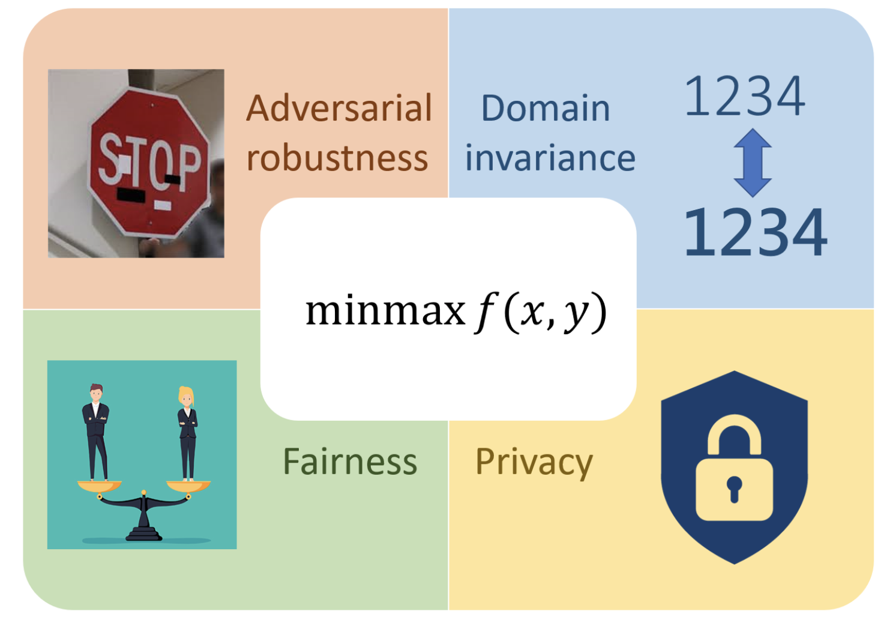

## Organizers
  * Soumik Pal
  * Sewoong Oh

## Schedule
  * **9:30  - 10:30**: Senior talk + Q/A (60 min)
  * **10:30 - 11:30**: Senior talk + Q/A (60 min)
  * **11:30 - 12:30**: Keynote: Andrea Montanari (60 min)
  * **12:30 - 2:30**: _Lunch provided (Zillow Commons)_ (120 min)
  * **2:30 - 3:10**: Junior talk + Q/A (40 min)
  * **3:10 - 3:50**: Junior talk + Q/A (40 min)
  * **3:50 - 4:30**: Junior talk + Q/A (40 min)
  * **4:30 - 5:10**: Junior talk + Q/A (40 min)
  * **5:10 - 6:10**: _Beer and wine (Zillow Commons)_ (60 min)

## Speakers

  * Andrea Montanari, Stanford (Keynote)
  * Kevin Jamieson, IFML (Senior talk)
  * Raghav Somani & Raghav Tripathi, IFML (Junior talk)
  * Jon Hayase, IFML & UW (Junior talk)
  * Geoff Schiebinger, UBC (Senior talk)
  * Becca Bonham-Carter, UBC (Junior talk)

## Sponsors

  

    
  

  

    
  

  

    
  

  

    <a href="https://www.sci.utah.edu/the-institute/news/138-general-news/717-minmax.html" target="_blank">SCALE-MoDL</a>
    </a>
  

  

    <a
    href="https://www.ifml.institute/" target="_blank">IFML</a>
  

  

  <a href="/">Kantorovich Initiative</a>
  


