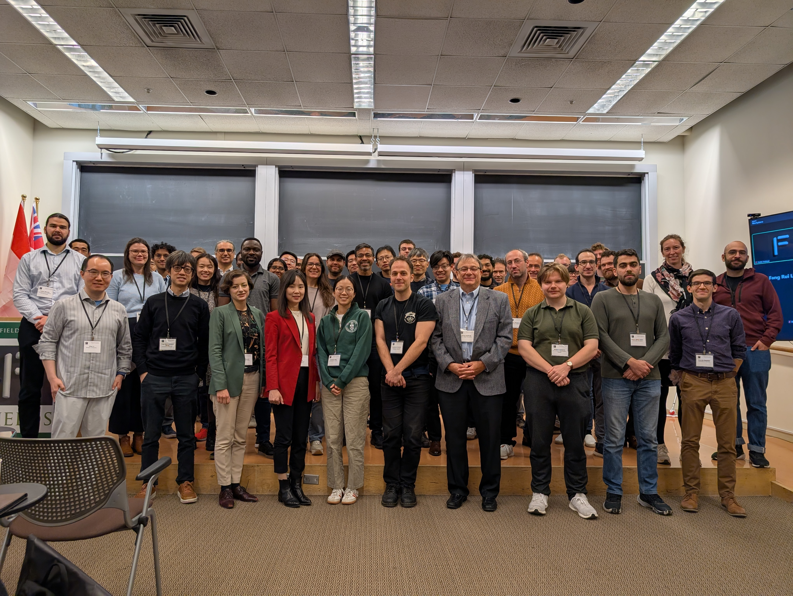

---
title: "Optimal transport: stochastics projections and applications"
event:
location: "Fields Institute, Room 230"
registration_info: Please register via the [PIMS Event webpage](https://www.pims.math.ca/events/251105-otspaa)
summary:
authors:
  - yhkim
tags:
  - event
categories:
  - event
date: 2025-11-05T09:00:00-05:00
publishDate: 2025-11-05T09:00:00-05:00
featured: false
draft: false

# Featured image
# To use, add an image named `featured.jpg/png` to your page's folder.
# Focal points: Smart, Center, TopLeft, Top, TopRight, Left, Right, BottomLeft, Bottom, BottomRight.
image:
  caption: ""
  focal_point: ""
  preview_only: true

# Projects (optional).
#   Associate this post with one or more of your projects.
#   Simply enter your project's folder or file name without extension.
#   E.g. `projects = ["internal-project"]` references `content/project/deep-learning/index.md`.
#   Otherwise, set `projects = []`.
#projects:

#url_video: 'https://mathtube.org/lecture/video/nonsmooth-approach-einsteins-theory-gravity'
#url_pdf: './event/mccann-distinguished-aug-1/KI_lecture-Robert_McCann.pdf'
#url_slides: './event/mccann-distinguished-aug-1/slides.pdf'
---  
### Event Details

#### Topic
This workshop brings together two exciting new directions in research: stochastic
transport and Wasserstein projections. Stochastic transport studies how
processes evolve over time rather than as instant shifts, making it particularly
useful for dynamic systems where decisions depend on the flow of information.
This perspective connects probability, geometry, and partial differential
equations and has proven powerful in understanding learning in neural networks,
development of cells, and the performance of algorithms. It also underpins
important advances in finance, risk management, and optimization, where choices
must be made sequentially and uncertainty plays a major role. Recent work has
introduced causal and adapted transport, which ensures models respect time and
available information, leading to robust ways of comparing systems. These
methods have already found wide-ranging applications and promise further
breakthroughs in dynamic, information-driven settings.

Wasserstein projections, on the other hand, address the problem of finding the
best-fitting model for observed data within a chosen class of models. This
approach is particularly important when robustness is required, such as in
economics or risk management. Though seemingly distinct from stochastic
transport, surprising connections have emerged, linking Wasserstein projections
to geometric inequalities, stochastic ordering of probability distributions, and
computational tools like the Sinkhorn algorithm. These intersections suggest
rich opportunities for advancing both theory and applications. The workshop’s
central aim is to create a platform where these two communities—often working
separately—can exchange ideas, spark collaborations, and explore their common
ground. By bringing together experts, early-career researchers, and students,
the workshop will foster new insights and collaborations that could reshape
classical areas of mathematics while also driving innovation in modern applied
fields.

Main Event Site: [Optimal transport: stochastics, projections, and applications |
Fields Institute for Research in Mathematical
Sciences](http://www.fields.utoronto.ca/activities/25-26/optimal-transport)

### Organizers
* Beatrice Acciaio (ETH Zurich)
* Young-Heon Kim (University of British Columbia)
* Soumik Pal (University of Washington)
* Brendan Pass (University of Alberta)
* Silvana Presenti (University of Toronto)

### Schedule

#### Wednesday, November 5th, 2025

  * 09:15 - 09:30 Opening Remarks
  * 09:30 - 10:30 [Wasserstein projections in the convex order](http://www.fields.utoronto.ca/talks/Wasserstein-projections-convex-order)
     * Benjamin Jourdain, CERMICS, École Nationale des Ponts et Chaussées
  * 10:30 - 11:00 Coffee Break
  * 11:00 - 11:35 [Worst-case generation via minimax optimization in Wasserstein space](http://www.fields.utoronto.ca/talks/Worst-case-generation-minimax-optimization-Wasserstein-space)
     * Yao Xie, Georgia Institute of Technology
  * 11:40 - 12:15 [Stability and Limit Laws of Stochastic Optimal Transport Maps](http://www.fields.utoronto.ca/talks/Stability-and-Limit-Laws-Stochastic-Optimal-Transport-Maps)
     * Tudor Manole, Massachusetts Institute of Technology
  * 12:15 - 12:20 Group Photos
  * 12:20 - 14:00 Lunch
  * 14:00 - 15:00 [Introduction to adapted optimal transport and applications](http://www.fields.utoronto.ca/talks/Introduction-to-adapted-optimal-transport-and-applications) Mathias Beiglboeck, University of Vienna
  * 15:00 - 15:45 Coffee Break & Poster Session
  * 15:45 - 16:05 [Lipschitz continuity of diffusion transport maps and exponential convergence of Sinkhorn's algorithm via creation of log-semiconcavity along heat flows](http://www.fields.utoronto.ca/talks/Lipschitz-continuity-diffusion-transport-maps-and-exponential-convergence-Sinkhorns-algorithm)
    * Katharina Eichinger, Laboratoire de Mathématiques d'Orsay, Université Paris-Saclay and ParMA, INRIA
  * 16:05 - 16:15 [Multi-to one-dimensional screening and semi-discrete optimal transport](http://www.fields.utoronto.ca/talks/Multi-to-one-dimensional-screening-and-semi-discrete-optimal-transport)
    * Omar Abdul Halim, University of Alberta
  * 16:15 - 16:25 [Conic Transport Metrics for Unbalanced Networks](http://www.fields.utoronto.ca/talks/Conic-Transport-Metrics-Unbalanced-Networks)
    * Mary Chriselda Antony Oliver, University of Cambridge

#### Thursday, November 6th, 2025

  * 09:30 - 10:30 [On Optimal Transport Projections: Analysis, Applications and Extensions](http://www.fields.utoronto.ca/talks/%E2%80%8B-Optimal-Transport-Projections-Analysis-Applications-and-Extensions)
    * Jose H. Blanchet, Stanford University
  * 10:30 - 11:00 Coffee Break
  * 11:00 - 11:35 [Shape-constrained density estimation with Wasserstein projection](http://www.fields.utoronto.ca/talks/Shape-constrained-density-estimation-Wasserstein-projection)
    * Ting-Kam Leonard Wong, University of Toronto
  * 11:40 - 11:50 [Sharp propagation of chaos for mean field langevin dynamics and mean field games.](http://www.fields.utoronto.ca/talks/Sharp-propagation-chaos-mean-field-langevin-dynamics-and-mean-field-games)
    * Manuel Arnese, Columbia University
  * 11:50 - 12:00 [Contracting Transport Maps on Weighted Manifolds](http://www.fields.utoronto.ca/talks/Contracting-Transport-Maps-Weighted-Manifolds)
    * William Dudarov, University of Washington, Seattle
  * 12:15 - 14:00 Lunch
  * 14:00 - 15:00 [Knothe-Rosenblatt maps via soft-constrained optimal transport](http://www.fields.utoronto.ca/talks/Knothe-Rosenblatt-maps-soft-constrained-optimal-transport)
    * Franca Hoffmann, California Institute of Technology
  * 15:00 - 15:30 Coffee Break
  * 15:30 - 15:40 [Diffusion Approximation to Schrödinger Bridges on Manifolds](http://www.fields.utoronto.ca/talks/Diffusion-Approximation-to-Schr%C3%B6dinger-Bridges-Manifolds)
    * Garrett Mulcahy, University of Washington, Seattle
  * 15:40 - 15:50 [On the adapted Bures-Wasserstein geometry](http://www.fields.utoronto.ca/talks/adapted-Bures-Wasserstein-geometry)
    * Songyan Hou, ETH Zürich
  * 15:50 - 16:00 [Asymptotic Expansion of Entropic Optimal Transport with a Diminishing Regularization Coefficient](http://www.fields.utoronto.ca/talks/Asymptotic-Expansion-Entropic-Optimal-Transport-Diminishing-Regularization-Coefficient)
    * Rentian Yao, University of British Columbia
  * 16:00 - 17:00 Open Problem Session

#### Friday, November 7th, 2025

  * 09:30 - 10:05 [The monopolist's free boundary problem in the plane: an excursion into the economic value of private information](http://www.fields.utoronto.ca/talks/monopolists-free-boundary-problem-plane-excursion-economic-value-private-information)
    * Robert McCann, University of Toronto
  * 10:10 - 10:45 [Conditional simulation via entropic optimal transport](http://www.fields.utoronto.ca/talks/Conditional-simulation-entropic-optimal-transport)
    * Ricardo Baptista, University of Toronto
  * 10:45 - 11:15 Coffee Break
  * 11:15 - 11:50 [A Class of Interpretable and Decomposable Multi-period Convex Risk Measures](http://www.fields.utoronto.ca/talks/Class-Interpretable-and-Decomposable-Multi-period-Convex-Risk-Measures)
    * Luhao Zhang, Johns Hopkins University
  * 11:50 - 12:25 [Bass Martingales: an overview](http://www.fields.utoronto.ca/talks/Bass-Martingales-overview)
    * Julio Backhoff-Veraguas, University of Vienna
  * 12:30 - 14:00 Lunch
  * 14:00 - 14:35 [A dynamical formulation of multi-marginal optimal transport](http://www.fields.utoronto.ca/talks/dynamical-formulation-multi-marginal-optimal-transport)
    * Yair Shenfeld, Brown University
  * 14:40 - 15:15 [Coupling via Pathwise Time Reversal](http://www.fields.utoronto.ca/talks/Coupling-Pathwise-Time-Reversal)
    * Dan Mikulincer, University of Washington

### Sponsors

  * [Pacific Institute for the Mathematical Sciences](https://www.pims.math.ca)
  * [Fields Institute](http://www.fields.utoronto.ca)
  * [ETH Zurich](https://ethz.ch/en.html)
  * [Department of Statistical Sciences, University of Toronto](https://www.statistics.utoronto.ca/)

